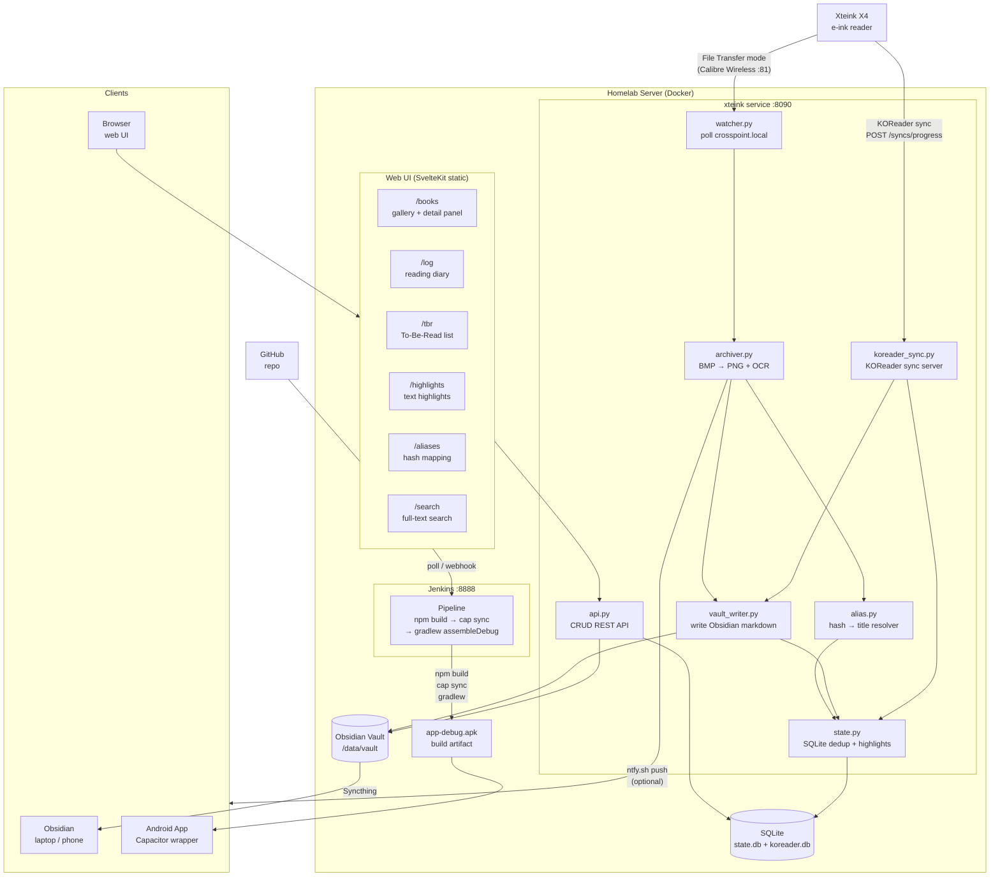

# Architecture

## Overview

Three core services run continuously on your homelab:

1. **Device Watcher + Screenshot Archiver** — polls for the X4, pulls screenshots, writes to Obsidian vault
2. **KOReader Sync Server** — receives reading progress updates from the X4
3. **Status Display (WebSocket)** — shows progress and errors on the X4 screen

## Full Component Diagram



All services are independent but share state via a SQLite database.

## System Diagram

```
┌─────────────────────────────────────────────────────────────────────────────┐
│ Xteink X4 (Crosspoint Firmware)                                           │
│                                                                              │
│  ┌──────────────────┐     ┌──────────────────┐     ┌──────────────────┐    │
│  │ File Transfer    │     │ KOReader Sync    │     │ WebSocket        │    │
│  │ Mode (port 80)   │     │ (settings)       │     │ Server (port 81) │    │
│  └────────┬─────────┘     └────────┬─────────┘     └────────┬─────────┘    │
└───────────┼────────────────────────┼────────────────────────┼───────────────┘
            │ HTTP API               │ HTTP POST              │ WebSocket
            │ /api/files, /download  │ /syncs/progress        │ START messages
            ▼                        ▼                        ▼
┌─────────────────────────────────────────────────────────────────────────────┐
│ Homelab Service (Python)                                                    │
│                                                                              │
│  ┌─────────────────────────────────────────────────────────────────────┐    │
│  │ Device Watcher (poll every 5‑10s)                                    │    │
│  │  • GET /api/status → device online?                                 │    │
│  │  • Connect WebSocket port 81 → on‑device status                    │    │
│  │  • GET /api/files?path=/screenshots → list screenshots             │    │
│  │  • Download via /download?path=...                                 │    │
│  │  • Convert BMP→PNG (Pillow)                                       │    │
│  │  • Write to Obsidian vault                                         │    │
│  └─────────────────────────────────────────────────────────────────────┘    │
│                           │                                                  │
│  ┌─────────────────────────────────────────────────────────────────────┐    │
│  │ KOReader Sync Server                                                 │    │
│  │  • POST /syncs/progress → receives progress updates                │    │
│  │  • GET /syncs/progress → query history                             │    │
│  │  • Stores updates in SQLite                                       │    │
│  │  • Triggers vault write callback                                  │    │
│  └─────────────────────────────────────────────────────────────────────┘    │
│                           │                                                  │
│  ┌─────────────────────────────────────────────────────────────────────┐    │
│  │ State & Observability                                               │    │
│  │  • SQLite state table (synced screenshots)                         │    │
│  │  • ntfy.sh / Home Assistant notifications                          │    │
│  │  • FastAPI status page (read‑only)                                │    │
│  └─────────────────────────────────────────────────────────────────────┘    │
└─────────────────────────────────────────────────────────────────────────────┘
            │
            ▼
┌─────────────────────────────────────────────────────────────────────────────┐
│ Obsidian Vault (filesystem)                                                │
│                                                                              │
│  vault/                                                                     │
│    Books/<Book Title>/                                                │
│      YYYY-MM-DD-NN.png  ← screenshot images                    │
│      YYYY-MM-DD-NN.json ← OCR + metadata sidecars                                           │
│    Reading Log/                                                             │
│      YYYY-MM-DD.md   ← daily reading diary                                 │
│    Books/                                                                   │
│      <Book Title>.md  ← per‑book timeline                                  │
└─────────────────────────────────────────────────────────────────────────────┘
            │
            │  **Note:** The service creates Obsidian-formatted Markdown files.
            │  Obsidian itself does not run on the server — the vault is synced
            │  via Syncthing to your laptop/phone where you view the notes.
            ▼
┌─────────────────────────────────────────────────────────────────────────────┐
│ Syncthing                                                                   │
│  • Syncs vault folder to Obsidian clients                                   │
│  • Works across laptop, phone, tablet                                      │
└─────────────────────────────────────────────────────────────────────────────┘
```

## Component Descriptions

### 1. Device Watcher & Screenshot Archiver

**Approach: Polling**

Poll `http://crosspoint.local/api/status` every 5 seconds. When the device responds with HTTP 200, trigger the screenshot sync workflow.

**Fallback:** If `crosspoint.local` DNS fails, set `DEVICE_HOST` env var to the device's static IP.

**On detection:**
1. Connect WebSocket to `ws://crosspoint.local:81/`
2. Send `START:Syncing screenshots...:1:/` — appears on X4 screen
3. List `/screenshots/` via `/api/files?path=/screenshots`
4. Group files by (book, calendar day of mtime)
5. For each file, check sync state by path — skip download if already archived
6. For new files, show progress: `START:Screenshot 3 of 5:1:/`
7. Download via `/download?path=...` (URL-encoded)
8. Convert BMP → PNG using Pillow, then OCR with Tesseract (text embedded in the PNG's iTXt metadata)
9. Write PNGs to `Books/<Title>/<date>-NN.png` (plus a `.json` sidecar)
10. Write/append the embed to `Books/<Title>.md` under a `## YYYY-MM-DD` heading
11. Mark synced in SQLite state table
12. Show completion; close WebSocket
13. Wait for device to go offline before the poll loop restarts

**State:** SQLite table `synced_screenshots` keyed by `(device_path, content_hash)`.

**Fallback:** If WebSocket fails, continue without on‑device feedback.

### 2. KOReader Sync Server

**Protocol:** Implements the KOReader kosync API:
- `POST`/`PUT /syncs/progress` — receive a progress update
- `GET /syncs/progress/{document}` — return the last known position
- `POST /users/create`, `GET /users/auth` — auth stubs KOReader expects

**Data received (kosync fields):**
```json
{
  "document": "d41d8cd98f00b204e9800998ecf8427e",
  "progress": "/body/DocFragment[8]/body/p[15]/text().234",
  "percentage": 0.42,
  "device": "Xteink X4",
  "device_id": "abc123"
}
```

The `document` field is `md5(filename)`, not readable metadata — CrossPoint
sends no title/author. Titles are resolved separately from the device file
listing via the alias table (`alias.py --scan`).

**Processing:**
1. Store the update in SQLite (`progress_updates`) with a Unix timestamp
2. Resolve the title from `document_aliases` (skip the vault write if unresolved)
3. Write to `Reading Log/YYYY-MM-DD.md` and the all-time `Reading Log.md`: `- **Title** — X.X% → Y.Y%`
4. Append a progress line to `Books/<Title>.md` under the `## YYYY-MM-DD` heading

**Implementation:** a custom minimal kosync server integrated into the main
service (`koreader_sync.py`), no external sync daemon.

### 3. On‑Device Status Display

**Protocol:** WebSocket to port 81 (same as Calibre plugin uses).

**Message flow:**
```
Client → START:message:size:path
Server → READY
Client → [binary data] (dummy byte optional)
Server → PROGRESS:received:total
Server → DONE / ERROR
```

**Display behavior:**
- Shows "Uploading: <message>" on the X4 screen
- Progress bar updates with `PROGRESS` messages
- Message clears ~6 seconds after `DONE`

**Usage:**
```python
ws = await websockets.connect("ws://crosspoint.local:81/")
await ws.send("START:Screenshot 3 of 5:0:/")
await ws.recv()  # DONE (size=0 — no progress bar, message only)
# Screen shows the message text; no progress bar
```

### 4. Data Store & Web UI

**Purpose:** SQLite is the source of truth for screenshot/progress metadata.
The Obsidian vault markdown is derived from it and can be rebuilt via
`POST /api/vault/rebuild` if sync conflicts corrupt the notes. The PNG bytes
themselves live in the vault (referenced by `vault_png_path`); a per-PNG JSON
sidecar keeps a DB-independent backup of the OCR text and metadata.

**`synced_screenshots` table** stores what's needed to rebuild the notes:
- `vault_png_path TEXT` — relative path to the PNG in the vault
- `ocr_text TEXT` — raw Tesseract output
- `ocr_corrected TEXT` — user-edited correction
- `user_notes TEXT` — free-form annotations

**`progress_updates` table** stores all KOReader sync events.

**CRUD API** (FastAPI, same process as the KOReader sync server):
- `GET /api/books` — book list with counts
- `GET /api/books/{slug}/screenshots` — screenshot metadata
- `GET /api/screenshots/{id}/image` — serve the PNG from the vault filesystem
- `PUT /api/screenshots/{id}` — edit OCR correction / notes
- `GET /api/reading-log` — reading progress history
- `GET`/`PUT /api/aliases` — hash → title mapping
- `GET`/`POST`/`PUT`/`DELETE /api/tbr` — to-be-read list
- `GET`/`POST`/`DELETE /api/screenshots/{id}/highlights` — text highlights
- `GET /api/search` — full-text search over OCR / notes / highlights
- `POST /api/vault/rebuild` — rebuild all vault markdown from the DB

**Web frontend** — a SvelteKit app (`web/`) built with `adapter-static` to
`web/build`, mounted at `/app` by FastAPI.

### 5. Observability Layer

**Notifications:** ntfy.sh or Home Assistant webhook:
- "📎 Archived N screenshots — Book Title"
- "📖 Progress updated — Book Title → page 145"
- "⚠️ Sync failed (attempt N)"

**Status Page:** FastAPI JSON endpoint (`/status`):
- Last sync time
- Books touched today
- Total screenshots archived
- Recent KOReader sync updates
- Last error (if any)


## Data Flow

```
Screenshot Flow:
X4 → HTTP GET /download → BMP → Pillow → PNG → Vault/Books/...

Reading Progress Flow:
X4 → HTTP POST /syncs/progress → Sync Server → SQLite → Vault/Reading Log/...

Status Display Flow:
Archiver → WebSocket ws://X4:81 → X4 screen shows "Uploading: message"
```

## Network Access Options

Two scenarios, two configs:

| Scenario | `DEVICE_HOST` | KOReader Sync URL on X4 |
| :--- | :--- | :--- |
| **At home (LAN)** | `crosspoint.local` | `http://homelab-ip:8090` |
| **Away (phone hotspot + Tailscale)** | X4's Tailscale IP | `http://server-tailscale-ip:8090` |

### Tailscale + Mobile Hotspot Setup

1. Install Tailscale on the homelab server.
2. Install the Tailscale Android app on the X4.
3. Both devices join the same Tailnet.
4. In `docker-compose.yml`, set `DEVICE_HOST` to the X4's Tailscale IP (`100.x.x.x`).
5. In KOReader Sync settings on the X4, enter the server's Tailscale IP: `http://100.x.x.x:8090`.

`network_mode: host` handles this automatically — the container shares the host's Tailscale interface with no extra configuration.

## Docker Deployment (Recommended)

```yaml
# docker-compose.yml
services:
  xteink:
    build: .
    network_mode: host  # required: resolves crosspoint.local (.local mDNS hostname needs host network)
    volumes:
      - ./vault:/data/vault
      - ./config:/data/config
      - ./state:/data/state
    environment:
      - DEVICE_HOST=crosspoint.local
    restart: unless-stopped
```

**Key points:**
- `network_mode: host` gives the container the host's Tailscale interface and mDNS resolver
- Set `DEVICE_HOST=crosspoint.local` at home; `DEVICE_HOST=100.x.x.x` (X4's Tailscale IP) when away
- Mount your Obsidian vault to `/data/vault`
- State directory persists the SQLite database across restarts
- Health check endpoint available at `http://localhost:8090/health`

## Reliability Design

- **Additive sync**: source files remain on device unless explicitly deleted
- **Idempotent**: state table prevents duplicate processing
- **Atomic writes**: batch files per (book, day) before Syncthing picks them up
- **Retry**: failed downloads retry on next poll cycle
- **Graceful degradation**: WebSocket failures don't stop screenshot sync
- **Persistence**: SQLite state survives restarts

## Technology Stack

| Component | Technology |
| :--- | :--- |
| **Deployment** | **Docker + docker-compose** (primary) |
| HTTP client | `aiohttp` + `asyncio` |
| WebSocket client | `websockets` |
| Image conversion | `Pillow` |
| Web server (sync) | `FastAPI` + `uvicorn` |
| State storage | `SQLite` (via `aiosqlite`) |
| File watching | None (polling only) |
| Cross‑device sync | Syncthing (external) |
| Notifications | `ntfy.sh` or `Home Assistant` webhook |