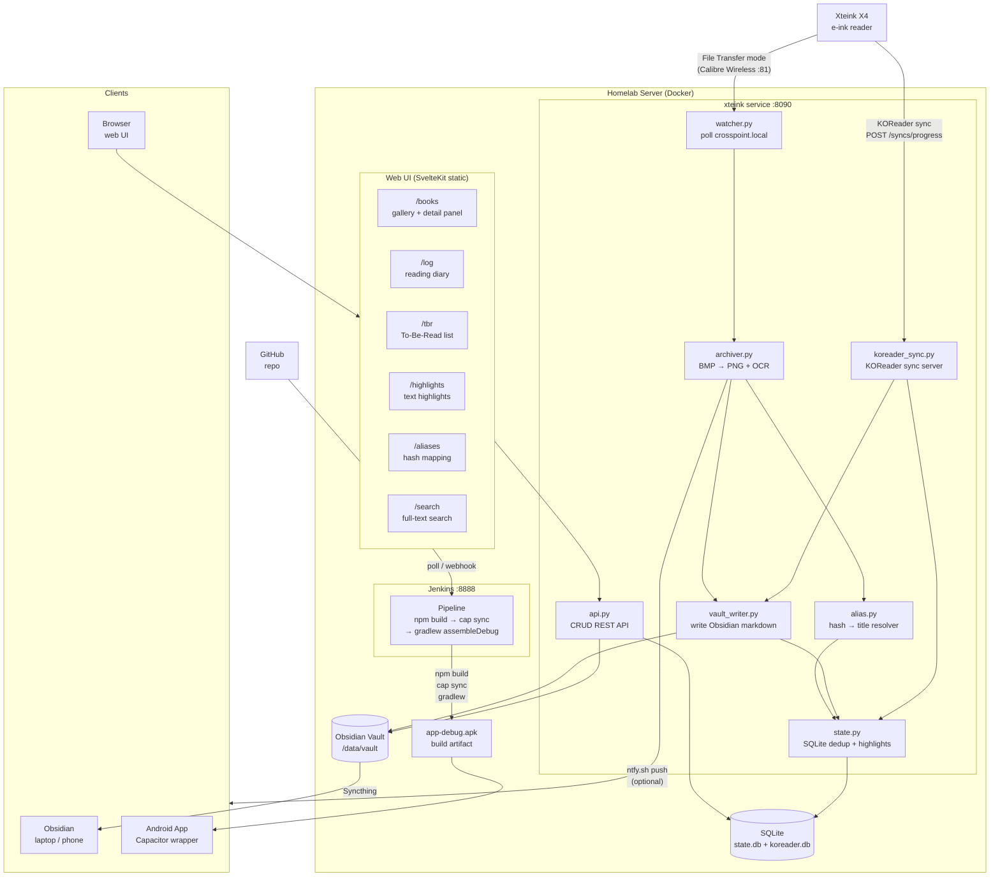

# Xteink X4 Commonplace Book

> Automatic screenshot archiving and reading diary for the Xteink X4 e‑ink reader, powered by a homelab service and Obsidian.

The service runs on your homelab server and writes Obsidian-formatted Markdown files. Obsidian syncs to your laptop/phone via Syncthing — it never runs on the server.

## Architecture



## What It Does

When you press **File Transfer** on your Xteink X4:

- **Pulls screenshots** (BMP → PNG + Tesseract OCR) into `Books/<Title>.md` with inline text callouts — searchable in Obsidian
- **Shows real-time progress** on the X4's screen during sync (same protocol as Calibre)
- **Resolves book titles** from the device file listing (no manual mapping needed for new books)

When you sync KOReader progress:

- **Writes reading log** to `Reading Log/YYYY-MM-DD.md` and `Reading Log.md` (all-time, newest first)
- **Updates book timeline** in `Books/<Title>.md` with percentage and section marker

**No custom firmware. No app to install. Just press the button.**

## Vault Structure

```
vault/
  Books/
    Pastoral.md              ← screenshots + reading progress, by date
    Pastoral/
      2026-07-04-01.png      ← PNG with OCR text in iTXt metadata
      2026-07-04-01.json     ← JSON sidecar (device path, hash, OCR, timestamp)
  Reading Log/
    2026-07-04.md            ← daily diary
  Reading Log.md             ← all-time log, newest day first
```

Each entry in `Books/<Title>.md` looks like:

```markdown
## 2026-07-04

![[Pastoral/2026-07-04-01.png]]
> [!quote] OCR text
> Apple. Now, because Bigland did not get home until afternoon...

- 22.1% → 45.3%  [§11]
```

## Quick Start (Docker)

### 1. Create host directories

```bash
mkdir -p /srv/docker/data/syncthing/shares/xteink-vault
mkdir -p /srv/docker/data/xteink-x4-commonplace/state
mkdir -p /srv/docker/data/xteink-x4-commonplace/config
```

### 2. Edit `docker-compose.yml`

Update the volume paths if your layout differs. The defaults expect:

| Container path | Host path |
|---------------|-----------|
| `/data/vault`  | `/srv/docker/data/syncthing/shares/xteink-vault` |
| `/data/state/` | `/srv/docker/data/xteink-x4-commonplace/state/` |

Set `DEVICE_HOST` to your X4's IP if `crosspoint.local` mDNS doesn't work inside Docker.

### 3. Build and start

```bash
docker-compose up -d
docker-compose logs -f
```

The service starts polling for the X4 immediately and runs the KOReader sync server on port 8090.

### 4. Configure the X4

In **Settings → KOReader Sync** on the X4:

- Server: `http://<homelab-ip>:8090`
- Username / password: anything (auth is stubbed)

Away from home? Install Tailscale on both the X4 and the server, then set `DEVICE_HOST` to the X4's Tailscale IP in `docker-compose.yml`.

### 5. Use it

- **Press File Transfer** → screenshots sync, progress bar appears on screen, book notes written
- **Sync KOReader** → reading log updated automatically

New books appear in the reading log after the first File Transfer session (when the service can scan the device file listing to map book hashes to titles).

## Syncthing Setup

Syncthing syncs the vault folder from the homelab to Obsidian on your laptop or phone. This is a one-time manual setup.

### 1. Install Syncthing

On the homelab server (Debian):
```bash
apt install syncthing
systemctl enable --now syncthing@$USER
```
Access the web UI at `http://homelab-ip:8384`.

On your laptop/phone, install Syncthing from [syncthing.net](https://syncthing.net/downloads/).

### 2. Share the vault folder

In the homelab Syncthing web UI:
1. **Add Device** — paste your laptop/phone's Syncthing device ID
2. **Add Folder** — point it at the vault path (`/srv/docker/data/syncthing/shares/xteink-vault`)
3. Share the folder with the laptop/phone device

On the laptop/phone: accept the incoming share, choose where to store it locally.

### 3. Point Obsidian at the synced folder

Open Obsidian → **Open folder as vault** → select the locally synced vault directory.

### 4. Ignore temporary files

The vault init script writes `.stignore` into the vault automatically. If you need to add it manually:
```
// .stignore
(?d).obsidian/workspace*
(?d).obsidian/cache
(?d).trash
```

### Tailscale (away from home)

To sync while away from your home network, install Tailscale on both the homelab and your laptop/phone. Syncthing will route through Tailscale automatically when on the same Tailnet.

## Running Without Docker

```bash
# Install uv (https://github.com/astral-sh/uv)
uv sync
DEVICE_HOST=crosspoint.local \
VAULT_PATH=/path/to/vault \
STATE_DB=/path/to/state.db \
KOREADER_DB=/path/to/koreader.db \
uv run python -m xteink_service
```

Requires `tesseract-ocr` installed on the host (`apt install tesseract-ocr`).

## One-shot sync (testing)

```bash
# Sync screenshots once against a live device
uv run python -m xteink_service.sync_once crosspoint.local /path/to/vault /path/to/state.db

# Capture one screenshot for inspection
uv run python -m xteink_service.capture crosspoint.local

# Manage book hash → title mappings
uv run python -m xteink_service.alias --state /path/to/state.db --koreader /path/to/koreader.db --scan --device crosspoint.local
```

## Documentation

- **[ARCHITECTURE.md](ARCHITECTURE.md)** — System design, components, data flow
- **[CLAUDE.md](CLAUDE.md)** — Agent/developer notes, architecture decisions, phase status
- **[TODO.md](TODO.md)** — Phase checklist

## Technologies

- Python 3.12, `asyncio`, `aiohttp`, `websockets`
- Pillow (BMP→PNG), `pytesseract` / Tesseract OCR
- FastAPI + uvicorn (KOReader sync server, port 8090)
- SQLite via `aiosqlite` (dedup + progress state)
- Obsidian (note-taking frontend, not on server)
- Syncthing (vault sync to devices)

## License

MIT